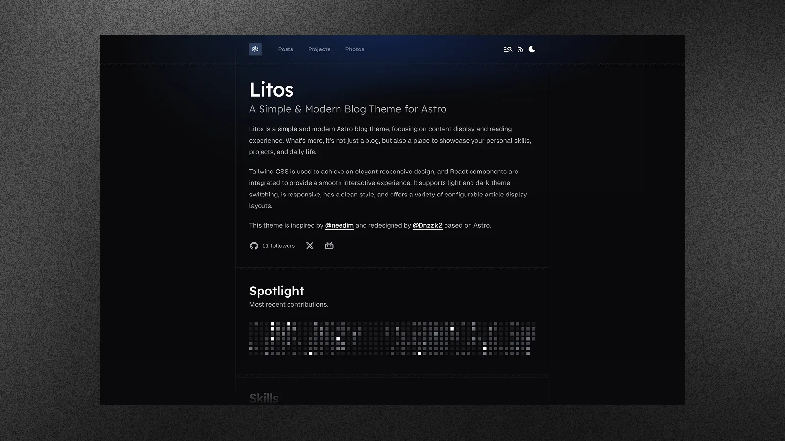

<div align="center">


# Litos


**A modern, elegant, and performance-focused blogging theme built for developers.**

[Demo](https://litos.vercel.app/) · [Report Bug](https://github.com/Dnzzk2/Litos/issues) · [Request Feature](https://github.com/Dnzzk2/Litos/issues)

</div>


## Introduction

Litos is a comprehensive blogging theme crafted with **Astro**, **React**, and **TailwindCSS**. It is designed to provide developers with a clean, professional, and highly customizable platform to showcase their work, thoughts, and photography.

Unlike traditional themes, Litos emphasizes visual aesthetics without compromising on performance. It features fluid animations, a polished design system, and a robust set of built-in components to help you build your personal brand effectively.



## Key Features

- **Modern Architecture**: Powered by Astro 5 for blazing fast performance and React 19 for dynamic interactivity.
- **Elegant Design**: A fully responsive, meticulously crafted UI using TailwindCSS 4.
- **Rich Content Support**:
  - **Posts**: Multiple layout options (compact, cover image) with extensive markdown support.
  - **Projects**: Dedicated section to showcase your portfolio with filterable tags.
  - **Photos**: A beautiful masonry layout for your photography collections.
- **Developer Centric**:
  - **Skills Showcase**: Visually represented technical stack configuration.
  - **Code Highlighting**: Integrated Expressive Code for beautiful syntax highlighting.
  - **Mathematical Scripts**: Katex support for rendering math equations.
- **Integrated Features**:
  - **Comments**: Gitalk integration for GitHub-based comments.
  - **SEO**: Built-in support for sitemaps, robots.txt, and meta tags.
  - **Analytics**: Configurable support for Vercount and Umami analytics.
  - **Dark Mode**: Native support for light and dark themes.

## Getting Started

Follow these simple steps to set up your Litos project locally.

### Prerequisites

Ensure you have the following installed on your machine:
- **Node.js** (v18 or higher)
- **pnpm** (recommended package manager)

### Installation

1.  **Clone the repository**

    ```bash
    git clone https://github.com/Dnzzk2/Litos.git
    cd Litos
    ```

2.  **Install dependencies**

    ```bash
    pnpm install
    ```

3.  **Start the development server**

    ```bash
    pnpm dev
    ```

    Your site should now be running at `http://localhost:4321`.

## Configuration

Litos is designed to be easily configurable. The primary configuration file is located at `src/config.ts`.

### Site Settings
Modify the `SITE` constant to update basic site information:
```typescript
export const SITE: Site = {
  title: 'Litos',
  description: 'Your site description here.',
  website: 'https://your-domain.com',
  author: 'Your Name',
  // ...other settings
}
```

### Feature Toggles
You can enable or disable specific features like the Skills Showcase or GitHub integration directly in the config file:
```typescript
export const SKILLSSHOWCASE_CONFIG = {
  SKILLS_ENABLED: true,
  // ...
}

export const GITHUB_CONFIG = {
  ENABLED: true,
  // ...
}
```

### Navigation
Links for the Header and Footer can be managed via `HEADER_LINKS` and `FOOTER_LINKS`.

## Scripts

| Script | Description |
| :--- | :--- |
| `pnpm dev` | Starts the local development server. |
| `pnpm build` | Builds the site for production. |
| `pnpm preview` | Previews the built production site locally. |
| `pnpm format` | Formats code using Prettier. |
| `pnpm check` | Runs Astro check for diagnostics. |

## License

Distributed under the MIT License. See [MIT LICENSE](LICENSE) for more information.

## Star History

<a href="https://www.star-history.com/#Dnzzk2/Litos&type=date&legend=top-left">
 <picture>
   <source media="(prefers-color-scheme: dark)" srcset="https://api.star-history.com/svg?repos=Dnzzk2/Litos&type=date&theme=dark&legend=top-left" />
   <source media="(prefers-color-scheme: light)" srcset="https://api.star-history.com/svg?repos=Dnzzk2/Litos&type=date&legend=top-left" />
   
 </picture>
</a>

---

<p align="center">
made with 💗 by <a href="https://github.com/Dnzzk2">Dnzzk2</a> !
</p>