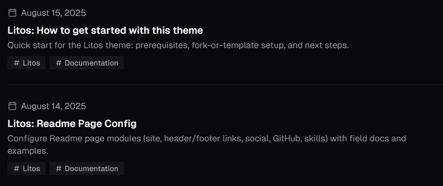
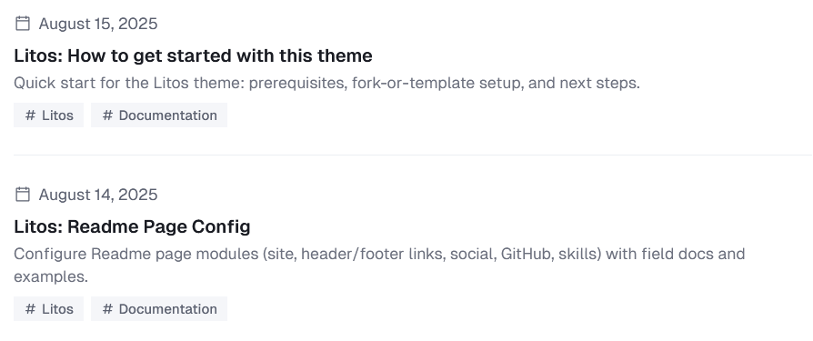
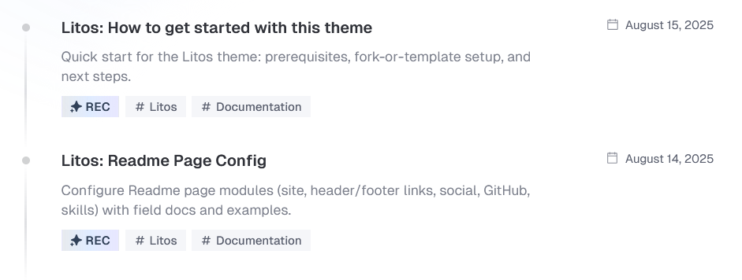
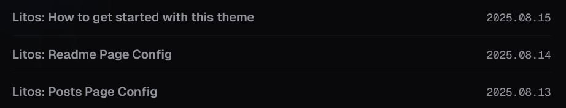
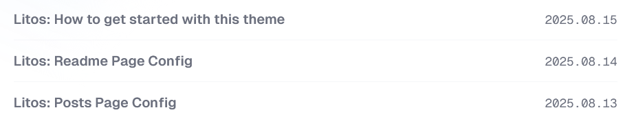
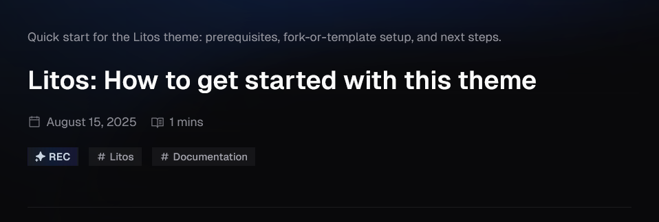
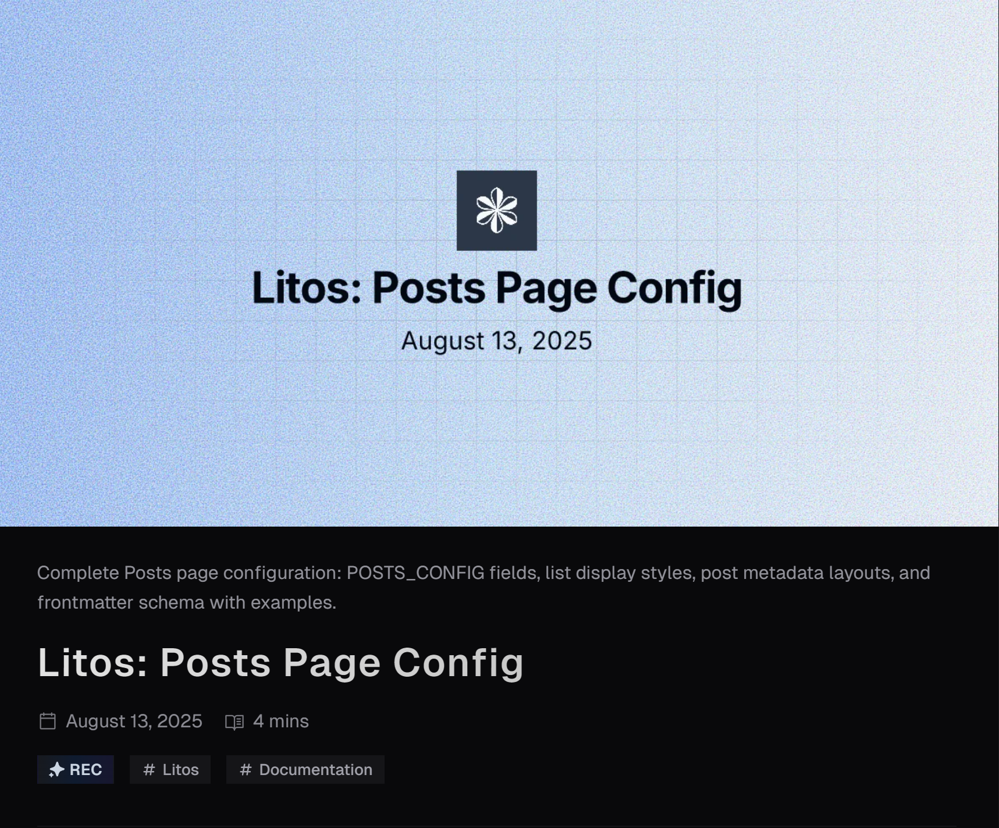
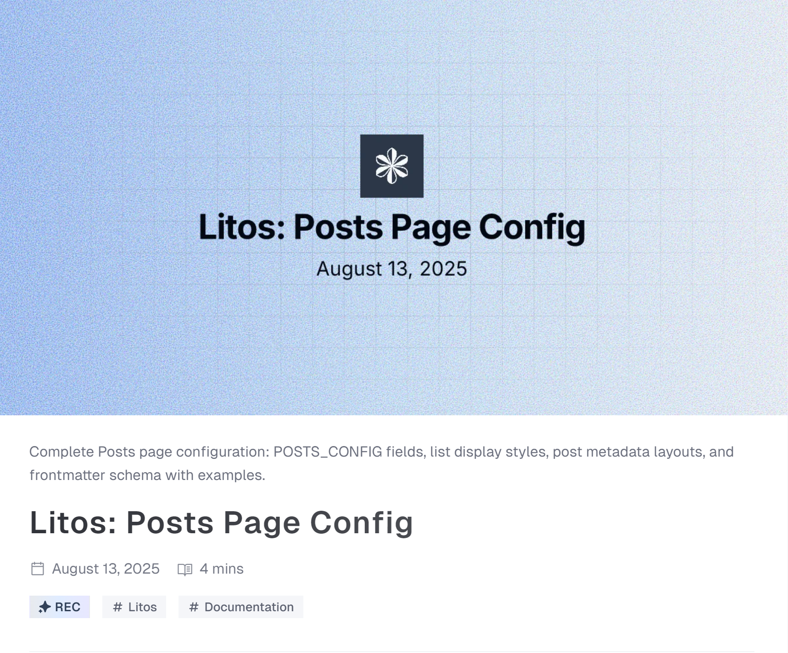
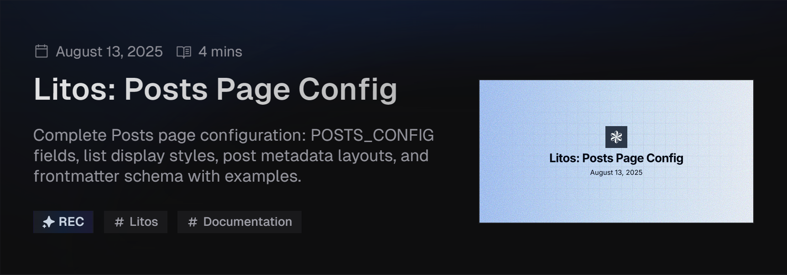
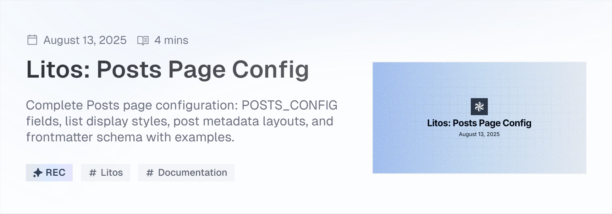

The following files are compatible with this document:

- `src/pages/posts/[...id].astro` - post specific content display page.
- `src/pages/posts/[...page].astro` - post list page.
- `src/content/posts` - posts collection
- `src/content.config.ts` - posts dataset and frontmatter configuration.
- `ec.config.mjs` - expressiveCode config.
- `plugins/index.ts` - remark and rehype plugins.
- `src/config.ts` - posts page config.
- `src/components/posts` - most of the components come from here.

### Posts Page Config

The posts page config is configured in the following code:

```ts title="config.ts"
export const POSTS_CONFIG: PostConfig = {
  title: 'Posts',
  description: 'Posts by Dnzzk2',
  introduce: 'Here, I will share the usage instructions for this theme to help you quickly use it.',
  author: 'Dnzzk2',
  homePageConfig: {
    size: 3,
    type: 'compact',
  },
  postPageConfig: {
    size: 10,
    type: 'minimal',
  },
  tagsPageConfig: {
    size: 10,
    type: 'time-line',
  },
  ogImageUseCover: false,
  postType: 'metaOnly',
  imageDarkenInDark: true,
  readMoreText: 'Read more',
  prevPageText: 'Previous',
  nextPageText: 'Next',
  tocText: 'On this page',
  backToPostsText: 'Back to Posts',
  nextPostText: 'Next Post',
  prevPostText: 'Previous Post',
  recommendText: 'REC',
}
```

There are a few configuration attributes, please refer to the table below for details.

| Property                                                                    | Description                                                                                                                                                                                                        |
| --------------------------------------------------------------------------- | ------------------------------------------------------------------------------------------------------------------------------------------------------------------------------------------------------------------ |
| title                                                                       | Title displayed on browser tags and title displayed on list pages.                                                                                                                                                 |
| description                                                                 | The metadata description in the `head` element of the list page.                                                                                                                                                   |
| introduce                                                                   | The introduce below the title on the list page.                                                                                                                                                                    |
| author                                                                      | The author of the posts.                                                                                                                                                                                           |
| homePageConfig                                                              | **readme page** configuration.                                                                                                                                                                                     |
| &nbsp;&nbsp;&nbsp;&nbsp;size                                                | The number of posts displayed on the **readme page**.                                                                                                                                                              |
| &nbsp;&nbsp;&nbsp;&nbsp;type                                                | In the **read page**, the style of displaying data in a list , `compact` 、`minimal` 、`time-line` or `image`.                                                                                                     |
| &nbsp;&nbsp;&nbsp;&nbsp;coverLayout <br/>&nbsp;&nbsp;&nbsp;&nbsp;(optional) | When the type is image, this attribute can set the position of the image in the card. You can choose left or right. If not set, it will appear alternately on the left and right.                                  |
| postPageConfig                                                              | Same as homePageConfig above, but size represents the base number of pages and is used for **post pages**.                                                                                                         |
| tagsPageConfig                                                              | Same as homePageConfig above, but size represents the base number of pages and is used for **tag pages**.                                                                                                          |
| ogImageUseCover                                                             | Whether to use the cover image as the Open Graph image.                                                                                                                                                            |
| postType                                                                    | The default display component for the top metadata of the post's specific content display page.You can configure `metaOnly`、 `coverSplit`、`coverTop`. <br/> Can be replaced by frontmatter settings for content. |
| imageDarkenInDark                                                           | Whether to darken the image in the dark mode.                                                                                                                                                                      |
| readMoreText                                                                | The text of the read more button.                                                                                                                                                                                  |
| prevPageText                                                                | The text of the previous page button.                                                                                                                                                                              |
| nextPageText                                                                | The text of the next page button.                                                                                                                                                                                  |
| tocText                                                                     | Title text of the directory                                                                                                                                                                                        |
| backToPostsText                                                             | The text of the back to posts button.                                                                                                                                                                              |
| nextPostText                                                                | The text of the next post button.                                                                                                                                                                                  |
| prevPostText                                                                | The text of the previous post button.                                                                                                                                                                              |
| recommendText                                                               | The text of the recommend tag.                                                                                                                                                                                     |

#### Type & PostType

In the above document, we mentioned configurable `types` for configuring the display style of list data on the readme page, posts page, and tags page, as well as configurable `postTypes` for displaying metadata at the top of the posts content page.

Here is the specific style display of `type`:

:::image-figure[compact]
(class:img-light)

(class:img-dark)
:::

:::image-figure[time-line]
(class:img-light)

(class:img-dark)
:::

:::image-figure[minimal]
(class:img-light)

(class:img-dark)
:::

:::image-figure[image]
(class:img-light)

(class:img-dark)
:::

Here is the specific style display of `postType`:

:::image-figure[metaOnly]
(class:img-light)

(class:img-dark)
:::

:::image-figure[coverTop]
(class:img-light)

(class:img-dark)
:::

:::image-figure[coverSplit]
(class:img-light)

(class:img-dark)
:::

### Frontmatter

After discussing the external list and overall design of the post, let's take a look at the content of the post together. These contents are all in the `src/content/posts` folder.

Below is the frontmatter of the post content:

```md title="post.md"
---
title: 'Litos: Posts Page Config'
description: ''
pubDate: 2025-08-13
author: 'Dnzzk2'
recommend: true
tags: ['Litos', 'Documentation']
---
```

You can configure the frontmatter of the post content in the following code:

```ts title="content.config.ts"
const posts = defineCollection({
  loader: glob({
    pattern: '**/*.{md,mdx}',
    base: './src/content/posts',
  }),
  schema: ({ image }) =>
    z
      .object({
        title: z.string(),
        description: z.string(),
        pubDate: z.date(),
        tags: z.array(z.string()).optional(),
        updatedDate: z.date().optional(),
        author: z.string().default(POSTS_CONFIG.author),
        cover: image().optional(),
        ogImage: image().optional(),
        recommend: z.boolean().default(false),
        postType: z.custom<PostType>().optional(),
        coverLayout: z.custom<CoverLayout>().optional(),
        pinned: z.boolean().default(false),
        draft: z.boolean().default(false),
      })
      .transform((data) => ({
        ...data,
        ogImage: data.ogImage ? data.ogImage : POSTS_CONFIG.ogImageUseCover && data.cover ? data.cover : undefined,
      })),
})
```

| Property    | Description                                                                                                                                                                             |
| ----------- | --------------------------------------------------------------------------------------------------------------------------------------------------------------------------------------- |
| title       | Title of the post.                                                                                                                                                                      |
| description | Overview of the content of the post, also used for SEO.                                                                                                                                 |
| pubDate     | Post release date.                                                                                                                                                                      |
| tags        | List of tags for posts                                                                                                                                                                  |
| updatedDate | Latest update date of the post. <br/> In the sorting of the post list, the priority value is greater than the publication date.                                                         |
| author      | The author of the post.                                                                                                                                                                 |
| cover       | When the type of the list is `image`, the cover image used for display, or the cover image displayed at the top of the postType `coverSplit` or `coverTop`                              |
| ogImage     | The Open Graph image of the post.                                                                                                                                                       |
| recommend   | Whether to display the recommend tag.                                                                                                                                                   |
| postType    | The display component for the top metadata of the post's specific content display page. You can configure `metaOnly`、 `coverSplit`、`coverTop`                                         |
| coverLayout | When the type is `image`, this attribute can set the position of the image in the card. You can choose `left` or `right`. If not set, it will appear alternately on the left and right. |
| pinned      | Whether to top the post.                                                                                                                                                                |
| draft       | Whether to hide the post.                                                                                                                                                               |

> [!TIP]
> Regarding `cover` and `ogImage`.
>
> `Cover` and `ogImage` are two independent attributes, and the only one that can connect them is `POSTS_CONFIG.ogImageUseCover`.
>
> `POSTS_CONFIG.ogImageUseCover` is enabled by default, so you only need to write `cover` to configure `ogImage` at the same time. This applies to situations where the `cover` and `ogImage` are the same. If you want to customize `ogImage`, you can set it separately.
>
> If `POSTS_CONFIG.ogImageUseCover` is not enabled, `ogImage` needs to be set separately. If you do not set it, the site's `ogImage` will be used as a fallback.
>
> `POSTS_CONFIG.ogImageUseCover` > `cover`

---

### Syntax and Code Style

This guide will show you how to format text using Markdown through a 3-day city trip itinerary. Learn Markdown while planning your journey!

#### Heading Levels

For travel notes, multiple heading levels help organize days, time blocks, and tips:

```markdown
# 3-Day City Trip Itinerary

## Day 1: Arrival & Old Town

### Morning Plan

#### Coffee Stops

##### Metro Tips

###### Notes
```

#### Text Formatting

When writing travel notes, highlight important info:

**Must-see spots** should be bold  
_Flexible time_ uses italics  
**_Critical cautions_** can use both  
~~Optional detours~~ use strikethrough

```markdown
**Must-see spots** should be bold
_Flexible time_ uses italics
**_Critical cautions_** can use both
~~Optional detours~~ use strikethrough
```

#### Packing List (Unordered List)

- Passport, visa
- Camera, extra battery
  - Bring a fast charger
  - Spare SD card
- Refillable water bottle
- Public transport card

```markdown
- Passport, visa
- Camera, extra battery
  - Bring a fast charger
  - Spare SD card
- Refillable water bottle
- Public transport card
```

#### Day 1 Schedule (Ordered List)

1. Airport → hotel check-in
2. Old Town walking tour
3. Evening river cruise
   1. Arrive 15 min early
   2. Queue at Gate B
   3. Window seats recommended

```markdown
1. Airport → hotel check-in
2. Old Town walking tour
3. Evening river cruise
   1. Arrive 15 min early
   2. Queue at Gate B
   3. Window seats recommended
```

#### Blockquotes

> Traveler tip: Buy a 24‑hour metro pass if you plan 3+ rides in a day.
>
> Save the hotel address in offline maps for quick access.

```markdown
> Traveler tip: Buy a 24‑hour metro pass if you plan 3+ rides in a day.
>
> Save the hotel address in offline maps for quick access.
```

#### Code Blocks

Use simple code to estimate budget:

```ts title="itinerary.ts"
type Budget = { flight: number; hotel: number; meals: number; transport: number }
export const total = (b: Budget) => b.flight + b.hotel + b.meals + b.transport

console.log(total({ flight: 1200, hotel: 450, meals: 180, transport: 60 })) // 1890
```

#### Tables

Sample schedule:

| Time   | Place           | Notes               |
| ------ | --------------- | ------------------- |
| 09\:00 | Old Town Square | Guided walking tour |
| 12\:30 | Riverside Cafe  | Lunch + short rest  |
| 18\:00 | City Pier       | Sunset cruise       |

#### Links and Images

More tips: [Official Tourism Board](https://example.com/travel 'Tourism Board')

Trip photo:
(style:width:50%)

#### Horizontal Rule

---

#### Inline Code

Metro line `A` runs every `5-7 minutes` during peak hours.

#### Math Formulas

Daily budget estimation: $budget = hotel + meals + transport$

Total trip:

$$
Total\ Budget = \sum_{d=1}^{3} (Hotel_d + Meals_d + Transport_d)
$$

#### Task Lists

Pre-trip checklist:

- [x] Book flights
- [x] Reserve hotel
- [ ] Buy metro pass
- [ ] Download offline maps

#### Footnotes

This itinerary draws on local travel guides(click to the footnote) [^1].

[^1]: City Tourism Guide, 2024 Edition. (click back to the text)

---

### Expressive-code config

In Markdown documents, we use code blocks to display code snippets and other content. This document explains how to customize the code block configuration.

The code blocks in this theme are configured using :link[Expressive Code]{id=https://expressive-code.com/} with all configuration options defined in the `ec.config.mjs` file. Below is the main configuration options:

```js title="ec.config.mjs"
import { defineEcConfig } from 'astro-expressive-code'
import { pluginCollapsibleSections } from '@expressive-code/plugin-collapsible-sections'
import { pluginLineNumbers } from '@expressive-code/plugin-line-numbers'

export default defineEcConfig({
  defaultLocale: 'zh-CN',
  defaultProps: {
    wrap: false,
    collapseStyle: 'collapsible-auto',
    showLineNumbers: false,
    preserveIndent: true,
  },
  minSyntaxHighlightingColorContrast: 0,

  styleOverrides: {
    uiFontFamily: 'GeistMono, Input Mono, Fira Code, ShangguSansSCVF, monospace',
    uiFontSize: '1em',
    codeFontFamily: 'GeistMono, Input Mono, Fira Code, ShangguSansSCVF, monospace',
    codeFontSize: '14px',
    codeLineHeight: '1.4',
    borderRadius: '0',
    codePaddingBlock: '0.8571429em',
    codePaddingInline: '1.1428571em',
    borderColor: ({ theme }) => (theme.type === 'dark' ? '#24273a' : '#e6e9ef'),

    frames: {
      frameBoxShadowCssValue: false,
      inlineButtonBackgroundActiveOpacity: '0.2',
      inlineButtonBackgroundHoverOrFocusOpacity: '0.1',
    },
    textMarkers: {
      backgroundOpacity: '0.2',
      borderOpacity: '0.4',
    },
  },

  plugins: [
    pluginCollapsibleSections({
      defaultCollapsed: false,
    }),
    pluginLineNumbers(),
  ],

  themes: ['catppuccin-macchiato', 'catppuccin-latte'],
  themeCssSelector: (theme) => (theme.name === 'catppuccin-macchiato' ? '.dark' : ':root:not(.dark)'),
  useDarkModeMediaQuery: false,
  useStyleReset: false,
})
```

You can go to the website to view the configuration options of expressive-code.
